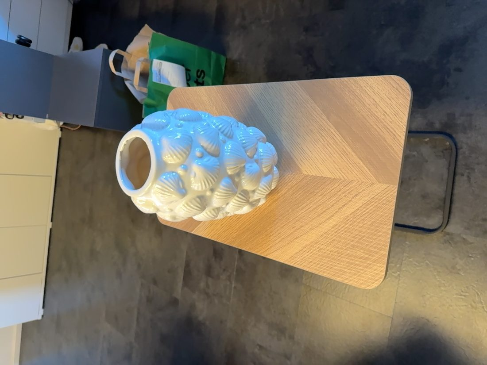
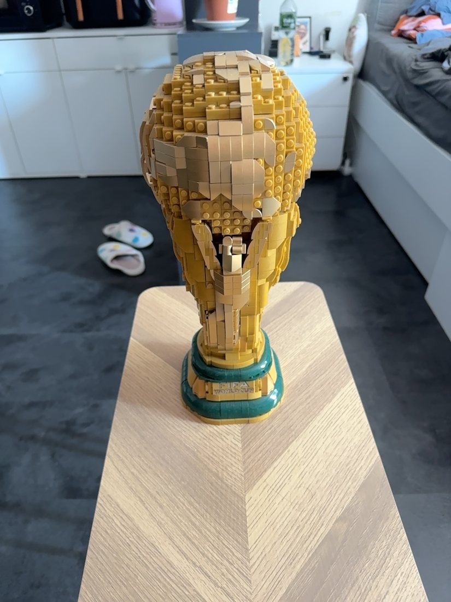
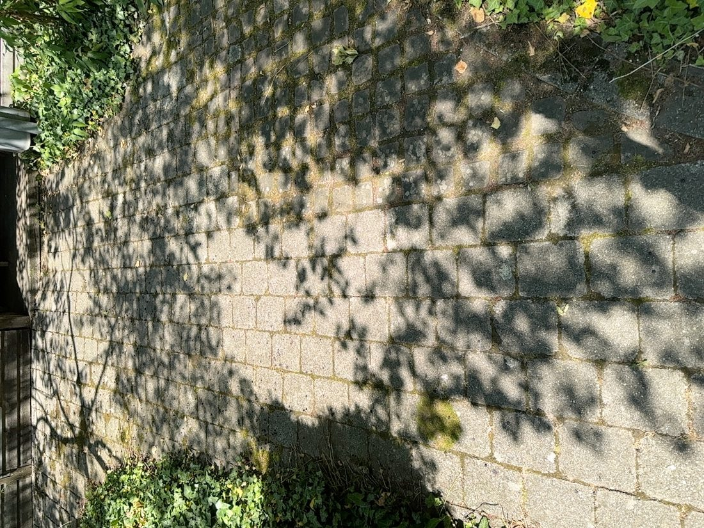
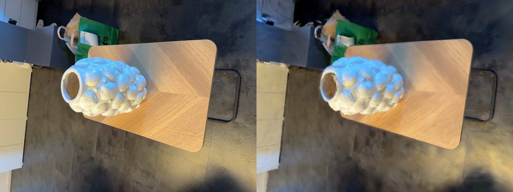
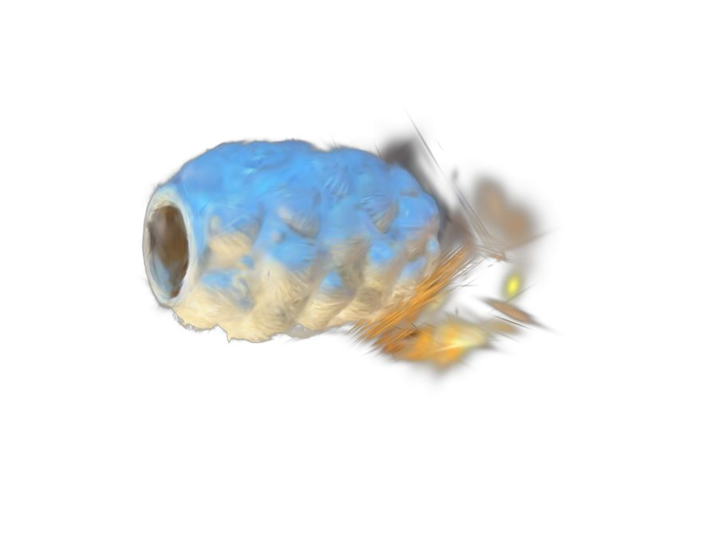

<!-- OWNER: Dominik Pleimes -->

Wie wird aus ein paar Handy-Fotos ein begehbares 3D-Modell? Diese Seite zeigt die komplette
Pipeline, die ich für unsere eigenen Szenen durchlaufen habe – von der **Aufnahme** über das
**Training** bis zum **Export** ins web-taugliche `.spz`-Format. Alle Bilder und Modelle auf
dieser Seite stammen aus selbst aufgenommenen Szenen (Vase, WM-Pokal, Wasserspray, Gartenhütte).

```{=html}
<style>
  .gs-flow{display:flex;flex-wrap:wrap;align-items:stretch;gap:6px;justify-content:center;margin:1.6rem 0 0.6rem;}
  .gs-step{flex:1 1 140px;min-width:128px;max-width:200px;background:#f5f8fd;border:1px solid #e1e8f4;
    border-radius:14px;padding:16px 12px;text-align:center;transition:transform .15s,box-shadow .15s;}
  .gs-step:hover{transform:translateY(-3px);box-shadow:0 8px 22px rgba(45,108,223,.13);}
  .gs-step .ico{font-size:30px;line-height:1;}
  .gs-step .t{font-weight:700;color:#1d2944;margin-top:9px;font-size:15px;}
  .gs-step .s{font-size:12px;color:#64708a;margin-top:3px;line-height:1.35;}
  .gs-step .n{display:inline-block;font-size:10.5px;font-weight:700;letter-spacing:.06em;color:#2d6cdf;
    background:#e7eefc;border-radius:99px;padding:1px 8px;margin-bottom:6px;text-transform:uppercase;}
  .gs-arr{display:flex;align-items:center;color:#9db4e0;font-size:20px;font-weight:700;}
  @media(max-width:600px){.gs-arr{display:none;}}

  .gs-facts{display:grid;grid-template-columns:repeat(auto-fit,minmax(120px,1fr));gap:10px;margin:1.2rem 0;}
  .gs-fact{background:#fafbfe;border:1px solid #e8edf6;border-radius:12px;padding:12px 14px;}
  .gs-fact .v{font-size:20px;font-weight:800;color:#2d6cdf;line-height:1.1;}
  .gs-fact .k{font-size:12px;color:#64708a;margin-top:3px;}

  .gs-gallery{display:grid;grid-template-columns:repeat(auto-fit,minmax(230px,1fr));gap:16px;margin:1.2rem 0;}
  .gs-card{border:1px solid #e6ebf4;border-radius:14px;overflow:hidden;background:#fff;
    box-shadow:0 2px 8px rgba(20,30,60,.05);transition:transform .15s,box-shadow .15s;}
  .gs-card:hover{transform:translateY(-3px);box-shadow:0 10px 26px rgba(20,30,60,.12);}
  .gs-card video{width:100%;display:block;aspect-ratio:16/9;object-fit:contain;background:#0d0d14;}
  .gs-card .cap{padding:10px 13px;}
  .gs-card .cap b{color:#1d2944;}
  .gs-card .cap .meta{font-size:12px;color:#6b7790;margin-top:2px;}
  .gs-card .badge{display:inline-block;font-size:11px;font-weight:600;border-radius:99px;padding:1px 8px;
    background:#eef3fd;color:#2d6cdf;margin-left:6px;}

  .gs-cta{display:inline-flex;align-items:center;gap:8px;margin-top:.4rem;padding:11px 20px;border-radius:10px;
    background:#2d6cdf;color:#fff !important;font-weight:600;text-decoration:none;transition:background .15s;}
  .gs-cta:hover{background:#1f5bc4;}

  #pl-viewer{position:relative;width:100%;aspect-ratio:16/9;min-height:300px;border-radius:14px;overflow:hidden;
    background:radial-gradient(120% 120% at 50% 0%,#1b2540 0%,#0d0d14 70%);border:1px solid #2a2a35;}
  #pl-canvas{width:100%;height:100%;display:block;outline:none;touch-action:none;}
  #pl-load{position:absolute;inset:0;margin:auto;width:max-content;height:max-content;padding:14px 26px;
    border:none;border-radius:12px;background:#2d6cdf;color:#fff;font-size:15px;font-weight:600;cursor:pointer;
    box-shadow:0 6px 20px rgba(0,0,0,.35);}
  #pl-load:hover{background:#3a78ea;}
  #pl-status{position:absolute;bottom:10px;left:10px;color:#cfcfe0;font-size:13px;background:rgba(20,20,28,.7);
    padding:3px 9px;border-radius:6px;display:none;}
  #pl-zoom{position:absolute;bottom:10px;right:10px;display:flex;flex-direction:column;gap:6px;}
  #pl-zoom button{width:34px;height:34px;font-size:20px;line-height:1;border-radius:6px;border:1px solid #444;
    background:rgba(20,20,28,.85);color:#eee;cursor:pointer;}
  #pl-zoom button:hover{background:rgba(45,108,223,.85);}
</style>

<div class="gs-flow">
  <div class="gs-step"><span class="n">Schritt 1</span><div class="ico">📸</div><div class="t">Aufnahme</div><div class="s">Fotos + Metadaten mit der App SplatKing</div></div>
  <div class="gs-arr">→</div>
  <div class="gs-step"><span class="n">Schritt 2</span><div class="ico">🧩</div><div class="t">SfM&nbsp;/&nbsp;COLMAP</div><div class="s">Kameraposen + Punktwolke rekonstruieren</div></div>
  <div class="gs-arr">→</div>
  <div class="gs-step"><span class="n">Schritt 3</span><div class="ico">🧠</div><div class="t">Training</div><div class="s">Jeden Punkt zu einem 3D-Gaussian optimieren</div></div>
  <div class="gs-arr">→</div>
  <div class="gs-step"><span class="n">Schritt 4</span><div class="ico">📦</div><div class="t">Export</div><div class="s">.ply als Master, .spz fürs Web (~10× kleiner)</div></div>
  <div class="gs-arr">→</div>
  <div class="gs-step"><span class="n">Ziel</span><div class="ico">🌐</div><div class="t">Web&nbsp;&&nbsp;AR</div><div class="s">Im Browser & in Augmented Reality</div></div>
</div>
```

---

## 1. Aufnahme {#aufnahme}

Für das Capturing nehme ich mit der iOS-App **[Gaussian SplatKing](https://apps.apple.com/us/app/gaussian-splatking/id6759175085)**
Fotos aus vielen verschiedenen Perspektiven auf. Die App erfasst dabei zusätzlich **Metadaten**
(Position, Bewegung, IMU/LiDAR) und exportiert alles gebündelt als `.zip`.

::: {.callout-note}
## Zwei Aufnahme-Modi
- **LiDAR-Capture** (iPhone Pro, *empfohlen*): liefert direkt ein fertiges COLMAP-Modell mit
  **metrischen, schwerkraft-ausgerichteten Kameraposen** und einer dichten Punktwolke. Bestes,
  stabilstes Ergebnis – das Modell steht im Viewer aufrecht.
- **Foto-Capture** (`photo_dual`): nur Bilder, **ohne Posen** → die Posen müssen erst per
  Structure-from-Motion (Schritt 2) berechnet werden.
:::

::: {layout-ncol="3"}





:::

**Aufnahme-Guidelines**, die bei mir den größten Unterschied gemacht haben:

::: {.columns}
::: {.column width="50%"}
**Goldene Regeln**

- **Scharf bleiben** – langsam & ruhig, keine Bewegungsunschärfe
- **60–80 % Überlappung** zwischen aufeinanderfolgenden Bildern
- **Gleichmäßiges Licht**, keine harten Wechsel, nichts Bewegtes im Bild
- **Textur hilft** – matte, strukturierte Oberflächen rekonstruieren besser als glänzende
:::
::: {.column width="50%"}
**🏺 Objekt vs. 🏠 Raum**

- *Objekt:* mittig halten, **360° umrunden**, 2–3 Ringe in verschiedenen Höhen, ~60–150 Bilder
- *Raum:* langsam abschreiten, alle Wände/Ecken abdecken, **Schleifen schließen**, 150–400+ Bilder
- Häufigster Fehler: zu wenig Überlappung → „Floater-Suppe" aus neuen Blickwinkeln
:::
:::

## 2. Vorverarbeitung – Structure from Motion {#sfm}

SplatKing exportiert Fotos und Metadaten, das Training braucht aber ein bestimmtes Format:
**COLMAP**. Bei reinen Foto-Aufnahmen rechnet daher zuerst **Structure-from-Motion (SfM)** aus
den überlappenden Bildern die **Kameraposen** und eine **dünne 3D-Punktwolke** – also *wo* jedes
Foto aufgenommen wurde und wie die Szene grob im Raum liegt.

> Bei LiDAR-Aufnahmen bringt SplatKing diese Posen + eine dichte Punktwolke schon mit – dann kann
> dieser Schritt übersprungen werden. *(Details zu SfM/COLMAP: siehe [Theorie & Methodik](../theorie/index.qmd) bzw. Gruppe 3.)*

## 3. Training {#training}

Das eigentliche 3D Gaussian Splatting. **Ziel: jeden COLMAP-Punkt zu einem 3D-Gaussian machen.**
Trainiert habe ich mit [gsplat](https://github.com/nerfstudio-project/gsplat) auf einer
NVIDIA RTX 4070 Super. Der Ablauf pro Iteration:

::: {.callout-tip icon="false"}
## Die Optimierungs-Schleife
1. Aus den COLMAP-Punkten werden **initiale Gaussians** mit Startwerten erzeugt
   (Position, Größe, Farbe, Opazität).
2. Die Szene wird aus mehreren Fotoperspektiven mit einem **differenzierbaren Rasterizer** gerendert.
3. Das Rendering wird **auf Pixelebene mit den Originalfotos verglichen** → ergibt den Fehler:

   $$\text{Gesamt-Loss} = \underbrace{L_{\text{Rekonstruktion}}}_{\text{Bildfehler}} \; + \; \text{gewichtete Regularisierungsterme}$$

4. Per **Gradient Descent** + Optimizer wird daraus ein neuer Wert pro Gaussian berechnet – und neu iteriert.
5. Zusätzlich alle *x* Iterationen: **Pruning, Splitting & Cloning** der Gaussians
   (überflüssige entfernen, zu grobe verfeinern).
:::

Und so sieht diese Schleife **live** aus – aus einer festen Kameraperspektive, über den kompletten
Trainingsverlauf. Links das echte Trainingsfoto (bleibt gleich), rechts der Render, der sich von einem
verwaschenen Klecks zum scharfen Modell entwickelt:

```{=html}
<figure style="margin:1.4rem 0;">
  <video src="video/training_vase.mp4" autoplay muted loop playsinline
    style="width:100%;border-radius:12px;border:1px solid #e6ebf4;background:#0d0d14;display:block;"></video>
  <figcaption style="font-size:13px;color:#6b7790;margin-top:6px;text-align:center;">
    Trainings-Zeitraffer der Vase (gsplat, RTX 4070&nbsp;Super): Original-Foto vs. gerendertes 3DGS-Modell,
    Step&nbsp;100&nbsp;→&nbsp;30.000. Der größte Sprung passiert in den ersten Tausend Schritten.
  </figcaption>
</figure>
```

Nach ~30.000 Iterationen passt das gerenderte Modell die Originalfotos sehr genau an. Der direkte
Vergleich zeigt es – **links das echte Foto, rechts das gerenderte 3DGS-Modell:**




<div class="gs-facts">
  <div class="gs-fact"><div class="v">~30.000</div><div class="k">Trainings-Iterationen</div></div>
  <div class="gs-fact"><div class="v">~880k</div><div class="k">Gaussians (Vase)</div></div>
  <div class="gs-fact"><div class="v">21,5 dB</div><div class="k">PSNR (Vase, Validierung)</div></div>
  <div class="gs-fact"><div class="v">~20–30 min</div><div class="k">Trainingszeit / Szene</div></div>
  <div class="gs-fact"><div class="v">RTX 4070S</div><div class="k">GPU (12 GB VRAM)</div></div>
</div>

::: {.callout-note collapse="true"}
## Parameter: Objekt vs. Raum (gsplat)
| Parameter | 🏺 Objekt | 🏠 Raum |
| --- | --- | --- |
| `--strategy` | `default` (densifiziert frei) | `default` |
| `--data-factor` | `1` (volle Auflösung) | `2` (halbe – spart VRAM) |
| `--max-steps` | `30.000` | `50.000` (größere, komplexere Szene) |
| `--sh-degree` | `3` | `3` |
| `--app_opt` | – | ✓ |

Beide Szenentypen trainieren mit gsplats `default`-Strategie – eine `mcmc`-Strategie
(gedeckelte Gaussian-Zahl) haben wir für Räume ausprobiert, sie führte bei uns aber zu
Problemen und wurde wieder verworfen. Stattdessen bekommt der Raum mehr Trainingsschritte
und **`--app_opt`** (Appearance Optimization): das gleicht Belichtungs-/Farbunterschiede
zwischen den Aufnahmen aus, die bei 300+ Fotos eines Raums stärker ins Gewicht fallen als
beim kurzen Objekt-Rundgang.

**`--sh-degree`** (Spherical-Harmonics-Grad) legt fest, wie viele Kugelflächenfunktions-
Koeffizienten pro Gaussian für blickwinkelabhängige Farbe (z. B. Glanzlichter, Reflexionen)
genutzt werden: `0` = nur eine feste Grundfarbe, höhere Grade erlauben zunehmend
richtungsabhängige Farbvariation, kosten aber mehr Speicher pro Gaussian. `3` ist gsplats
Maximum und für beide Szenentypen sinnvoll.
:::

## 4. Export {#export}

Nach dem Training werden die Gaussians im **PLY-Format** gespeichert – ein 3D-Dateiformat zur
Beschreibung einer Liste von Elementen (hier: alle Gaussians einer Szene). Der **Header** gibt
Anzahl und Eigenschaften vor, danach folgen pro Gaussian die jeweiligen Werte.

Für webbasierte Anwendungen konvertiere ich die `.ply` anschließend zu **`.spz`** – das ist
**effizienter und komprimierter (~10×)** bei praktisch identischer Qualität und liegt bereits im
RUB-Koordinatensystem von three.js / Babylon.js. Optional lassen sich Streu-Gaussians vorher in
[SuperSplat](https://supersplat.play.canvas.app/) entfernen oder das Objekt freistellen:

::: {.columns}
::: {.column width="62%"}
```text
ply
format binary_little_endian 1.0
element vertex 877358        ← Anzahl Gaussians
property float x             ← Position
property float y
property float z
property float opacity       ← Opazität (Alpha)
property float scale_0       ← Form / Kovarianz
property float rot_0         ← Rotation (Quaternion)
property float f_dc_0        ← Farbe (Spherical Harmonics)
...
end_header
<binäre Werte pro Gaussian>
```
:::
::: {.column width="38%"}


`.ply` → `.spz`: **~10× kleiner**, ready für Babylon.js & WebXR.
:::
:::

## 5. Modell-Galerie {#galerie}

Vier selbst trainierte Szenen – die Videos zeigen eine automatische Kamerafahrt um das fertige Modell:

```{=html}
<div class="gs-gallery">
  <div class="gs-card">
    <video src="video/vase.mp4" autoplay muted loop playsinline></video>
    <div class="cap"><b>Vase</b><span class="badge">Objekt</span><div class="meta">LiDAR · ~880k Gaussians · PSNR 21,5</div></div>
  </div>
  <div class="gs-card">
    <video src="video/wm_pokal.mp4" autoplay muted loop playsinline></video>
    <div class="cap"><b>WM-Pokal</b><span class="badge">Objekt</span><div class="meta">LEGO-Modell · LiDAR-Capture</div></div>
  </div>
  <div class="gs-card">
    <video src="video/gartenhuette.mp4" autoplay muted loop playsinline></video>
    <div class="cap"><b>Gartenhütte</b><span class="badge">Szene</span><div class="meta">Außenaufnahme · 525 Fotos</div></div>
  </div>
  <div class="gs-card">
    <video src="video/wasserspray.mp4" autoplay muted loop playsinline></video>
    <div class="cap"><b>Wasserspray</b><span class="badge">Objekt</span><div class="meta">Foto-Capture · COLMAP-Posen</div></div>
  </div>
</div>
```

### Eigenes Modell – live & interaktiv

Hier eingebettet: mein trainiertes **Vase**-Modell als echtes, drehbares 3DGS direkt im Browser
(per Maus/Touch rotieren & zoomen). Alle vier Modelle – inklusive **Datei-Upload** und einem
**First-Person-Viewer zum Begehen** der Szenen – gibt es auf der Seite *Web & AR*.

```{=html}
<div id="pl-viewer">
  <canvas id="pl-canvas"></canvas>
  <button id="pl-load">▶&nbsp; Interaktives 3D-Modell laden</button>
  <div id="pl-status">Initialisiere …</div>
  <div id="pl-zoom">
    <button type="button" data-zoom="in"  aria-label="Hineinzoomen">+</button>
    <button type="button" data-zoom="out" aria-label="Herauszoomen">−</button>
  </div>
</div>
<script>
(function(){
  var btn=document.getElementById("pl-load"), statusEl=document.getElementById("pl-status");
  var canvas=document.getElementById("pl-canvas");
  function setStatus(t){statusEl.style.display=t?"block":"none";statusEl.textContent=t;}
  function load(s,cb){var el=document.createElement("script");el.src=s;el.onload=cb;document.head.appendChild(el);}
  window.addEventListener("keydown",function(e){
    if(!(e.key==="+"||e.key==="="||e.key==="-"||e.key==="_"))return;
    e.preventDefault();e.stopPropagation();
    if(canvas.__zoomHandler)canvas.__zoomHandler(e.key==="-"||e.key==="_"?"out":"in");
  },true);
  function start(){
    var engine=new BABYLON.Engine(canvas,true,{preserveDrawingBuffer:true,stencil:true});
    var scene=new BABYLON.Scene(engine);
    scene.clearColor=new BABYLON.Color4(0.05,0.05,0.08,1);
    var cam=new BABYLON.ArcRotateCamera("c",-Math.PI/2,Math.PI/2.2,6,BABYLON.Vector3.Zero(),scene);
    cam.attachControl(canvas,true);cam.wheelPrecision=50;cam.lowerRadiusLimit=1.5;cam.upperRadiusLimit=25;cam.minZ=0.1;
    cam.inputs.removeByType("ArcRotateCameraMouseWheelInput"); // Rad soll die Seite scrollen, nicht zoomen
    function zoomCamera(direction){
      var step=Math.max(0.15,cam.radius*0.15);
      var next=cam.radius+(direction==="in"?-step:step);
      cam.radius=Math.min(Math.max(next,cam.lowerRadiusLimit),cam.upperRadiusLimit);
    }
    canvas.__zoomHandler=zoomCamera;
    document.querySelectorAll("#pl-zoom [data-zoom]").forEach(function(b){
      b.addEventListener("pointerdown",function(e){e.preventDefault();e.stopPropagation();zoomCamera(b.getAttribute("data-zoom"));});
      b.addEventListener("click",function(e){e.preventDefault();e.stopPropagation();zoomCamera(b.getAttribute("data-zoom"));});
    });
    engine.runRenderLoop(function(){scene.render();});
    window.addEventListener("resize",function(){engine.resize();});
    setStatus("Lade Vase-Modell …");
    BABYLON.SceneLoader.ImportMeshAsync(null,"","../web-ar/models/vase.spz",scene)
      .then(function(res){
        var m=res.meshes[0];
        m.rotationQuaternion=BABYLON.Quaternion.RotationAxis(BABYLON.Axis.X,Math.PI/2); // Vase-Splats: -Z ist "oben" -> Y-up (per PCA auf den Splat-Positionen ermittelt)
        m.computeWorldMatrix(true); m.refreshBoundingInfo(true);
        var bb=m.getBoundingInfo().boundingBox;
        var diag=bb.maximumWorld.subtract(bb.minimumWorld).length()||6;
        cam.setTarget(bb.centerWorld); cam.radius=diag*1.05;
        cam.lowerRadiusLimit=diag*0.05; cam.upperRadiusLimit=diag*4;
        cam.minZ=Math.min(0.05,diag*0.01); cam.wheelPrecision=Math.max(0.5,60/diag);
        setStatus("");
      })
      .catch(function(e){setStatus("Fehler: "+(e&&e.message?e.message:e));});
  }
  btn.addEventListener("click",function(){
    btn.style.display="none";
    if(window.BABYLON&&BABYLON.SceneLoader){start();return;}
    setStatus("Lade Babylon.js …");
    load("https://cdn.babylonjs.com/babylon.js",function(){
      load("https://cdn.babylonjs.com/loaders/babylonjs.loaders.min.js",start);
    });
  });
})();
</script>
```

<a class="gs-cta" href="../web-ar/index.qmd">Alle Modelle interaktiv erkunden & begehen →</a>

---

### Quellen {#quellen}
- [3D Gaussian Splatting for Real-Time Radiance Field Rendering (SIGGRAPH 2023)](https://repo-sam.inria.fr/fungraph/3d-gaussian-splatting/) — die zugrundeliegende Methode (siehe auch [Theorie & Methodik](../theorie/index.qmd#quellen))
- [gsplat (nerfstudio-project)](https://github.com/nerfstudio-project/gsplat) — die Trainingsbibliothek, mit der alle Modelle auf dieser Seite trainiert wurden
- [COLMAP](https://colmap.github.io/) — Structure-from-Motion/Multi-View-Stereo, rechnet die Kameraposen für Foto-Aufnahmen ohne LiDAR
- [Gaussian SplatKing (iOS-App)](https://apps.apple.com/us/app/gaussian-splatking/id6759175085) — Aufnahme-App für Fotos + LiDAR-Metadaten
- [SuperSplat](https://supersplat.play.canvas.app/) — browserbasiertes Tool zum Freistellen/Bereinigen der trainierten Splats
- [spz-Format (Niantic Labs)](https://github.com/nianticlabs/spz) — komprimiertes Export-Format für den Web-Viewer
