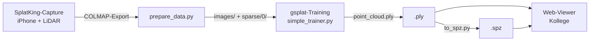

# Splat-Pipeline: Bilder → Splats → `.ply` / `.spz`

Pipeline für die Modularbeit *„Augmented Reality + Gaussian Splatting im Web"*.
Sie verwandelt aufgenommene Bilder in ein trainiertes 3D-Gaussian-Splatting-Modell,
das als **`.ply`** (kanonisch) oder **`.spz`** (komprimiert, web-freundlich) an den
Web-Viewer (Babylon.js / WebXR) übergeben wird.

> Praktischer, kürzerer Leitfaden mit Aufnahme-Richtlinien und Objekt-vs.-Raum-Tipps:
> [TUTORIAL.md](TUTORIAL.md).



| Stufe | Skript | Läuft auf |
| --- | --- | --- |
| 1. Daten aufbereiten | `pipeline/prepare_data.py` | macOS **oder** Windows |
| 2. Training | gsplat `simple_trainer.py` | **nur Windows + NVIDIA-GPU** |
| 3. `.ply → .spz` | `pipeline/to_spz.py` | macOS **oder** Windows |
| Orchestrierung | `pipeline/run_pipeline.py` | startet alle drei |

---

## Warum Windows fürs Training?

3D Gaussian Splatting (gsplat) braucht eine **CUDA-fähige NVIDIA-GPU**. macOS
hat kein CUDA, daher läuft das **Training auf dem Windows-PC mit der RTX 4070
Super (12 GB)**. Aufbereitung (Stufe 1) und Konvertierung (Stufe 3) sind
leichtgewichtig und laufen auch auf dem Mac – praktisch zum Entwickeln und für
die `.spz`-Konvertierung.

---

## Voraussetzungen

- **[uv](https://docs.astral.sh/uv/)** (Paket- und Env-Manager – ersetzt conda)
- Zum Training zusätzlich auf dem Windows-PC:
  - Aktueller **NVIDIA-Treiber**
  - Vorkompiliertes gsplat-Wheel → kein CUDA-Toolkit nötig.
    Alternative JIT-Build → **CUDA Toolkit 12.x** + **Visual Studio Build Tools (MSVC)**.
- **[Gaussian SplatKing](https://apps.apple.com/us/app/gaussian-splatking/id6759175085)**
  (iOS) für die Aufnahme – exportiert ein fertiges COLMAP-Modell.

---

## Projektstruktur

```
.
├── pipeline/
│   ├── prepare_data.py     # SplatKing-Export → gsplat-Datenlayout
│   ├── run_colmap.py       # Posen rechnen (nur für Aufnahmen ohne COLMAP-Modell)
│   ├── run_pipeline.py     # End-to-End: prepare → train → convert
│   └── to_spz.py           # .ply → .spz
├── pyproject.toml          # uv-Projekt (+ CUDA-Index-Konfiguration)
├── data/                   # Datensätze — bis auf data/vase/ alle gitignored
│   └── vase/               # Beispiel-Datensatz, im Repo (siehe unten)
├── results/                # Trainings-Outputs         (gitignored)
├── captures/               # Rohe Aufnahmen            (gitignored)
├── tools/colmap/           # COLMAP-Binary             (gitignored)
└── third_party/gsplat/     # gsplat-Checkout           (gitignored)
```

---

## Was ist im Repo, was nicht

Für die Bewertung/Nachvollziehbarkeit reicht der **Code** — die eigentlichen Foto-/Video-
Daten sind groß und größtenteils reproduzierbar, deshalb ist nur ein kleiner Teil davon
eingecheckt:

| Ordner | Im Repo? | Warum |
| --- | --- | --- |
| `pipeline/*.py`, `README.md`, `TUTORIAL.md`, `pyproject.toml`, `uv.lock` | ✅ ja | Das ist der eigentliche Code/die Doku — das Einzige, was zum Nachvollziehen der Logik nötig ist. |
| `data/vase/` | ✅ ja (~59 MB) | **Beispiel-Datensatz**: die kleinste, rohe LiDAR-Aufnahme (Vase) — direkt trainierbar, kein COLMAP nötig. Damit lässt sich Stufe 2 (Training) nachvollziehen, ohne selbst eine Aufnahme machen zu müssen (siehe Schnellstart unten für den genauen Befehl). |
| `captures/`, restliche `data/*` (gartenhuette, wasserspray, wm_pokal) | ❌ nein | Rohe/aufbereitete Aufnahmen der übrigen Szenen (bis zu 1,4 GB pro Szene) — für die Code-Bewertung nicht nötig; Nachweis der Ergebnisse liegt als Bilder/Videos/`.spz` auf der Website (`pipeline/index.qmd`, `web-ar/models/`). |
| `results/` | ❌ nein | Trainings-Checkpoints/`.ply`-Dateien — groß und aus `data/` + Stufe 2 reproduzierbar. |
| `tools/colmap/` | ❌ nein | Vorkompiliertes COLMAP-Binary (~771 MB) — Installationsanleitung siehe *Einrichtung → 4.* unten. |
| `third_party/gsplat/` | ❌ nein | gsplat-Checkout — Installationsanleitung siehe *Einrichtung → 2.* unten. |

Kurz: **alles, was fehlt, ist entweder per Anleitung in diesem README nachinstallierbar
(gsplat, COLMAP) oder war ohnehin nur Rohmaterial/Output, kein Code** — bis auf den einen
kleinen Beispiel-Datensatz, der genau deshalb drinbleibt.

---

## Einrichtung

### 1. Repository + uv-Umgebung

```bash
# Leichte Tools (numpy/pillow/tqdm) – funktioniert auf Mac und Windows
uv sync
```

### 2. Trainings-Stack (nur Windows-PC)

```bash
# a) PyTorch mit CUDA 12.4 (aus dem in pyproject.toml konfigurierten Index)
uv sync --group train

# b) gsplat klonen
git clone https://github.com/nerfstudio-project/gsplat third_party/gsplat

# c) gsplat installieren – Variante A: vorkompiliertes Wheel (empfohlen, kein Compiler nötig)
#    Den Suffix an die installierte torch-Version anpassen: pt<MAJOR><MINOR>cu124
#    (torch 2.5 → pt25cu124). torch-Version prüfen mit:
#    uv run python -c "import torch; print(torch.__version__)"
uv pip install gsplat --index-url https://docs.gsplat.studio/whl/pt25cu124

#    gsplat – Variante B: aus Quelltext bauen (braucht CUDA Toolkit + MSVC)
# uv pip install gsplat

# d) Beispiel-Abhängigkeiten + Helper-Libs des Trainers
uv pip install -r third_party/gsplat/examples/requirements.txt --no-build-isolation
uv pip install -e third_party/gsplat/libs/scene -e third_party/gsplat/libs/stage
```

> **Reihenfolge ist wichtig:** torch muss **vor** gsplat und den Beispiel-Deps
> installiert sein, weil diese CUDA-Erweiterungen gegen torch bauen. Deshalb
> `--no-build-isolation`.

Installation prüfen:

```bash
uv run python -c "import torch; print('CUDA:', torch.cuda.is_available())"   # -> CUDA: True
```

### 3. (Optional) spz-Bindings für die `.spz`-Konvertierung

```bash
uv pip install "spz @ git+https://github.com/nianticlabs/spz.git"
```

Ohne diese Bindings funktioniert alles andere weiterhin – `to_spz.py` verweist
dann auf den Browser-Konverter <https://nianticlabs.github.io/spz>.

### 4. (Für Aufnahmen ohne Posen) COLMAP

Manche SplatKing-Exporte (Schema `splatpack.v2`, `captureType: photo_dual`)
enthalten **nur Fotos + EXIF/IMU-Metadaten, aber keine Kameraposen und keine
Punktwolke**. Dann muss zuerst **COLMAP** die Posen rechnen (Stufe 0, siehe unten).

Vorkompiliertes Windows-Binary (mit CUDA) von den
[COLMAP-Releases](https://github.com/colmap/colmap/releases) holen, entpacken
und entweder nach `tools/colmap/` legen (wird automatisch gefunden), auf den PATH
setzen, oder beim Aufruf via `--colmap-exe` / `$COLMAP_EXE` angeben:

```powershell
# Beispiel: Release-ZIP nach tools/colmap entpacken
# tools/colmap/bin/colmap.exe  -> wird von run_colmap.py automatisch erkannt
tools\colmap\bin\colmap.exe -h   # Installation prüfen
```

---

## Aufnahme mit SplatKing

1. Szene mit **Gaussian SplatKing** aufnehmen (LiDAR aktiv lassen).
   - **Objekte:** in mehreren Höhen 360° umrunden, ~30–60 % Überlappung.
   - **Innenräume:** langsam abschreiten, alle Wände/Ecken abdecken,
     gleichmäßiges Licht.
2. In der App als **COLMAP-Modell exportieren** (Bilder + Kameraposen + Punkte).
3. Den Export-Ordner auf den Windows-PC übertragen.

---

## Schnellstart (ein Befehl)

```bash
uv run python pipeline/run_pipeline.py --scene stuhl \
    --input /pfad/zum/splatking_export
```

Ergebnis: `results/stuhl/stuhl.ply` (und `results/stuhl/stuhl.spz`, falls die
spz-Bindings installiert sind).

**Export ohne Kameraposen?** Liefert SplatKing nur Fotos (Schema `splatpack.v2`,
`photo_dual`) statt eines COLMAP-Modells, einfach `--colmap` ergänzen – dann rechnet
COLMAP zuerst die Posen (Stufe 0), bevor trainiert wird:

```bash
uv run python pipeline/run_pipeline.py --scene wasserspray \
    --input /pfad/zum/splatking_export --colmap \
    --data-factor 2
```

Für große Innenräume (mehr Schritte + Appearance-Optimierung gegen ungleichmäßiges
Licht über viele Fotos hinweg):

```bash
uv run python pipeline/run_pipeline.py --scene wohnzimmer \
    --input /pfad/zum/splatking_export \
    --data-factor 2 --max-steps 50000 -- --app_opt
```

> Wir haben für Räume anfangs `--strategy mcmc --cap-max` (gedeckelte Gaussian-Zahl)
> ausprobiert, das führte aber zu Problemen; am Ende hat sich `default` (wie bei
> Objekten) + mehr Trainingsschritte + `--app_opt` bewährt. Die `mcmc`-Strategie wird
> von diesem Wrapper daher nicht mehr unterstützt.

Vorher mit `--dry-run` nur den Trainingsbefehl anzeigen lassen.

---

## Einzelschritte (manuell)

### Stufe 0 – Posen rechnen (COLMAP, nur ohne mitgelieferte Posen)

Nur nötig, wenn der Export **keine** Kameraposen enthält (z. B. `splatpack.v2` /
`photo_dual`). Erzeugt aus den Fotos ein `sparse/0/`-Modell (Posen + Punktwolke):

```bash
uv run python pipeline/run_colmap.py \
    -i /pfad/zum/splatking_export \
    -o data/wasserspray_sfm
```

Ergebnis: `data/wasserspray_sfm/images/` + `data/wasserspray_sfm/sparse/0/`. Diesen
Ordner danach wie einen normalen COLMAP-Export an Stufe 1 übergeben (`-i data/wasserspray_sfm`).
Nützliche Optionen: `--matcher sequential` (für video-artige Sequenzen),
`--min-quality 0.3` / `--drop-bands poor` (verwackelte Frames anhand von
`quality_flags.csv` aussortieren), `--colmap-exe <pfad>` (COLMAP-Binary explizit).

### Stufe 1 – Daten aufbereiten

```bash
uv run python pipeline/prepare_data.py \
    -i /pfad/zum/splatking_export \
    -o data/stuhl \
    --downsample 2,4
```

Erzeugt `data/stuhl/images/`, `data/stuhl/images_2/`, `data/stuhl/images_4/`
und `data/stuhl/sparse/0/`.

### Stufe 2 – Training (gsplat)

Aus dem `examples`-Verzeichnis von gsplat heraus:

```bash
cd third_party/gsplat/examples

# Objekte (Standard-Densification)
uv run python simple_trainer.py default \
    --data_dir ../../../data/stuhl \
    --result_dir ../../../results/stuhl \
    --data_factor 1 --sh_degree 3 --save_ply --disable_viewer

# Innenräume (mehr Schritte + Appearance-Optimierung)
uv run python simple_trainer.py default \
    --data_dir ../../../data/wohnzimmer \
    --result_dir ../../../results/wohnzimmer \
    --data_factor 2 --max_steps 50000 --sh_degree 3 --app_opt \
    --save_ply --disable_viewer
```

Die `.ply` landet unter `results/<szene>/ply/point_cloud_<step>.ply`.
`run_pipeline.py` kopiert automatisch die mit der höchsten Schrittzahl nach
`results/<szene>/<szene>.ply`.

### Stufe 3 – `.ply → .spz`

```bash
uv run python pipeline/to_spz.py -i results/stuhl/stuhl.ply -o results/stuhl/stuhl.spz
```

`.spz` ist ~10× kleiner als `.ply` bei praktisch identischer Qualität und ist
bereits im RUB-Koordinatensystem (three.js / Babylon.js).

---

## VRAM-Tipps für 12 GB

- **`--data-factor 2`** (oder `4`) trainiert auf halber/viertel Auflösung –
  der größte Hebel gegen „out of memory".
- Bei Bedarf `--max_steps` reduzieren oder gsplats eigenes
  `--strategy.refine-stop-iter` früher setzen – kostet etwas Detail, spart aber
  Zeit/Speicher.
- **`--app_opt`** (Appearance Optimization) kostet zusätzliches VRAM, gleicht dafür
  Belichtungs-/Farbunterschiede zwischen den Aufnahmen aus – sinnvoll bei großen
  Räumen mit vielen Fotos und ungleichmäßigem Licht (siehe Beispiel oben).

---

## Übergabe an den Web-Viewer

- **`.ply`** – wird von den meisten Splat-Viewern und Babylon.js direkt geladen.
- **`.spz`** – kompakt fürs Web; lässt sich im Browser unter
  <https://nianticlabs.github.io/spz> auch ohne lokale Installation prüfen.

---

## Captures ohne Kameraposen (COLMAP)

Aktuelle SplatKing-Exporte (Schema `splatpack.v2`, `photo_dual`) liefern **nur
Fotos + EXIF/IMU-Metadaten – keine Kameraposen und keine Punktwolke**. Auch
beliebige Bilder/Videos aus anderen Quellen haben keine Posen. In beiden Fällen
rechnet zuerst **COLMAP** (Stufe 0, `pipeline/run_colmap.py`) Posen + Sparse-Punktwolke;
das erzeugte `sparse/0/`-Modell geht danach wie ein fertiger COLMAP-Export in
`prepare_data.py`.

Am einfachsten über das Flag `--colmap` in `run_pipeline.py` (siehe Schnellstart),
oder manuell als Stufe 0 (siehe oben). COLMAP muss installiert sein
(Abschnitt *Einrichtung → 4.*).

## LiDAR-Capture (bringt Posen mit)

Ein **LiDAR-Capture** aus SplatKing exportiert direkt ein fertiges COLMAP-Modell
(`COLMAP_Text_Model/` mit `sparse/0/` + `images/`) inklusive metrischer Kameraposen
und einer dichten LiDAR-Punktwolke als `points3D.txt`. Das ist der beste Ausgangspunkt:
**kein `--colmap`/Stufe 0 nötig**, einfach direkt darauf trainieren (kein `prepare`
erforderlich, da das Layout schon stimmt):

```powershell
uv run python pipeline/run_pipeline.py --scene vase `
    --data-dir "data/vase/LidarSeries_.../COLMAP_Text_Model" `
    --data-factor 1
```

Hinweis: `--data-dir` zeigt auf das vorhandene Modell (nur lesen) und unterscheidet sich
vom `--scene`-Namen, damit der Rohexport nicht überschrieben wird. Die Tiefenkarten unter
`sensor_data/` werden für Standard-Training nicht gebraucht (optional für Depth-Supervision).

---

## Fehlersuche

| Symptom | Ursache / Lösung |
| --- | --- |
| `CUDA: False` | NVIDIA-Treiber prüfen; CUDA-Build von torch installiert? (`uv sync --group train`) |
| `COLMAP executable not found` / `colmap not found` | COLMAP installieren und nach `tools/colmap/` legen, auf den PATH setzen oder `--colmap-exe` / `$COLMAP_EXE` angeben (Abschnitt *Einrichtung → 4.*) |
| `No complete COLMAP model found` | Export ohne Posen (`photo_dual`): mit `--colmap` laufen lassen bzw. zuerst `run_colmap.py` (Stufe 0). Oder in SplatKing als **COLMAP-Modell** exportieren |
| `No module named 'imageio'` (o. ä. Example-Dep) | Trainer-Abhängigkeiten installieren: `uv pip install -r third_party/gsplat/examples/requirements.txt --no-build-isolation` **und** `uv pip install -e third_party/gsplat/libs/scene -e third_party/gsplat/libs/stage` |
| `No module named 'gsplat.color_correct'` / `gsplat.losses` | Das alte gsplat-Wheel passt nicht zum Checkout. gsplat **aus dem Quelltext** bauen: `uv pip install -e third_party/gsplat --no-build-isolation` |
| `Ninja is required` / `Error compiling objects` beim gsplat-Build | `uv pip install ninja`; im **x64-Developer-Prompt** (vcvars64) mit `DISTUTILS_USE_SDK=1` bauen; `C:\msys64\…` aus dem PATH nehmen, falls MinGW-Header reinfunken |
| `glm/gtc/type_ptr.hpp: No such file` beim gsplat-Build | gsplat-Submodule holen: in `third_party/gsplat` `git submodule update --init --recursive` |
| gsplat-Build-Fehler unter **torch 2.6** (kein Wheel für `pt26cu124`) | gsplat aus dem Quelltext bauen; im Dev-Prompt mit `DISTUTILS_USE_SDK=1`. Der Checkout-`build.py` ist auf nvcc=C++17 / cl=C++20 gestellt (torch-2.6-Header brechen unter nvcc+C++20); das experimentelle Inference-Extension ist standardmäßig aus (`GSPLAT_BUILD_INFERENCE=1` zum Aktivieren) |
| `OverflowError: ... uint64` / `'map' object is not subscriptable` (pycolmap) | NumPy auf **<2** halten (`uv pip install "numpy<2"`); COLMAP-Modell als **TXT** statt `.bin` verwenden (`run_colmap.py` konvertiert automatisch – pycolmap liest `.bin` auf Windows falsch) |
| `import spz` → `DLL load failed` | Die `spz.pyd` braucht `z.dll` (zlib) im selben Ordner. Eine vorhandene `z.dll` aus dem venv neben `site-packages/spz/spz*.pyd` kopieren, oder den Browser-Konverter nutzen |
| `Input quaternion should be a 3- or 4-vector` / `cannot reshape array` **oder** Training lädt **nur 1 (oder 0) Bilder** aus einem TXT-Modell | LiDAR-/Pose-only-COLMAP-Exporte haben **leere POINTS2D-Zeilen** (keine Tracks). Der vendorte pycolmap-Textleser (Python-2-Code) verwechselt das mit Dateiende und verschluckt sich an nicht-materialisierten `map()`-Iteratoren. In `site-packages/pycolmap/scene_manager.py` in **`_load_images_txt`** und **`_load_points3D_txt`** jedes `np.array(map(...))` zu `np.array(list(map(...)))` machen und in `_load_images_txt` echtes EOF (`readline()==''`) von Leerzeilen unterscheiden (Leerzeile = leere POINTS2D-Zeile). Nach jedem venv-Neuaufbau erneut nötig |
| `gsplat trainer not found` | gsplat nach `third_party/gsplat` klonen oder `--gsplat-dir` setzen |
| `VIRTUAL_ENV does not match` (Warnung) | Harmlos – ein anderes venv ist in der Shell aktiv; `deactivate` blendet es aus |
